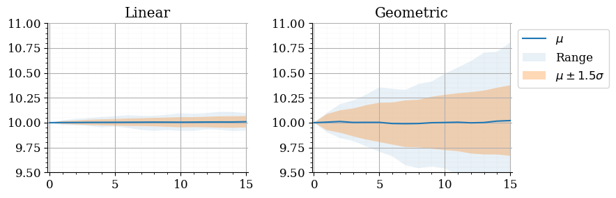
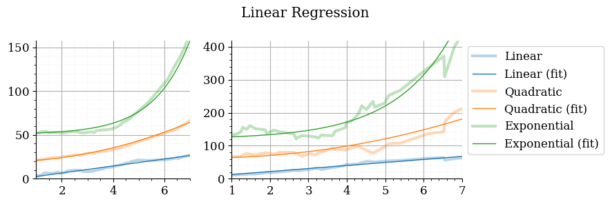
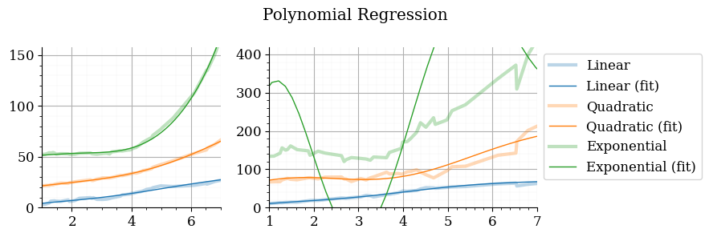

# Overview

This repository originally contained a number of computational models which can be used for data science.

In addition, there are some utilities.

In `src`:

- An object parser which converts JSON data to Python classes: `object_parser.py`.
- An OAS-generator for Python classes: `oas.py`.
- A parallelization framework for load testing: `parallel.py`.

# Usage

## List supported modules

```sh
./main <TAB>
# this will list the support modules
echo            fft             linear_fit      random_walk     semilinear_fit
```

## Run a module

Using `main`

```sh
./main random_walk
./main linear_fit
./main semilinear_fit
```

Or, as Python modules

```sh
python3 src/data_science/random_walk.py
```

# Examples

Below are examples of various models, ranging from simple linear models with analytical solutions to more complex models with numerical solutions.

## Random walk

[src/random_walk.py](src/random_walk.py) generates datasets that behave like random walks.



## Linear Models

[src/linear_fit.py](src/linear_fit.py) fits linear models. The simplicity of the models reduces overfitting, but this is not explicitly tested.

1. A linear regression model using normalized input data, while assuming a specific function (e.g. quadratic or exponential).



2. Polynomial regression. A linear model (w.r.t. the parameters) that uses non-linear basis functions.
Note that the fit for the exponential signal on the right-most plot is poor.



## Semi-linear Models

[src/semilinear_fit.py](src/semilinear_fit.py) fits various non-linear models.

1. Bayesian ridge regression, with polynomial and sinoid basis functions.
2. A Gaussian Process.

Note that these models estimate both a mean and a standard deviation, which can be used to define a confidence interval (C.I.).

The accuracy is derived using relative mean absolute error.
It is an overestimation because the test-data overlaps with the training-data.


Sampling from the Gaussian Process produces a collection of possible futures.


# Setup

Using a `Makefile` for convenience.

```sh
make install
make test
```

## Optional

Setup completions

```sh
source setup/setup.sh
```
